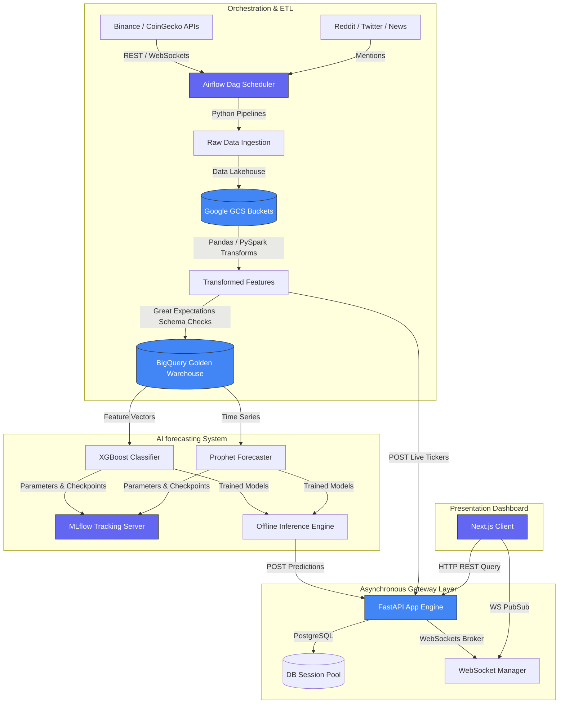

# Cryptrix — Realtime Crypto Intelligence & AI Prediction Platform

Cryptrix is a production-grade, enterprise-ready real-time cryptocurrency analytics and predictive intelligence platform. It leverages high-frequency API ingestion, distributed ETL, MLOps pipeline tracking, asynchronous web microservices, and a modern TypeScript dashboard.

---

## 🚀 Architectural Blueprint

The platform implements a clean enterprise architecture separating ingestion pipelines, storage lakes, deep ML prediction nodes, serving gateways, and front-facing clients.



---

## 🛠️ Technology Stack

| Layer | Technology | Purpose |
| :--- | :--- | :--- |
| **Frontend** | Next.js (App Router), TS, Tailwind, Recharts | Glassmorphic Tickers & Predictions Dashboard |
| **Backend API** | FastAPI, SQLAlchemy Async, PostgreSQL | Asynchronous high-throughput gateway & WebSocket Broadcaster |
| **Orchestration** | Apache Airflow, Docker | Distributed Ingestion & ML Auto-Retraining triggers |
| **Pipelines** | Pandas, PySpark, Great Expectations | Feature Engineering & Data Quality schema assertions |
| **ML Engine** | XGBoost, Prophet, scikit-learn | Multi-horizon trend classifiers & price forecasting |
| **MLOps** | MLflow | Model Registry, artifact tracking, parameters logging |
| **Observability** | Prometheus, Grafana | Telemetry latency metrics & data validation alerts |
| **Infra & Ops** | Docker, Terraform, Google Cloud Platform | Infrastructure-as-code and container isolation |

---

## 📁 Repository Organization

```
Cryptrix/
├── .github/workflows/        # Automated CI/CD workflows
├── backend/                  # FastAPI microservice
│   ├── app/
│   │   ├── api/v1/           # Versioned API routes & websockets
│   │   ├── core/             # DB pooling & Websocket Managers
│   │   ├── models/           # SQLAlchemy schemas & Pydantic validators
│   │   └── utils/            # Custom loggers & helpers
│   └── Dockerfile            # Multi-stage production Python container
├── data_engineering/         # ETL & Scheduling
│   ├── airflow/dags/         # Hourly ingest & Retraining schedulers
│   └── pipelines/            # Ingest clients & Pandas transformations
├── frontend/                 # Next.js UI dashboard
│   ├── src/app/              # App Router Dashboard interface
│   ├── src/components/ui/    # Custom glassmorphic primitives
│   └── Dockerfile            # Multi-stage standalone Node container
├── ml/                       # MLOps forecasting pipeline
│   ├── training/             # XGBoost/Prophet trainers + MLflow metrics logs
│   └── inference/            # Prediction workers posting to serving layers
├── monitoring/               # Prometheus target configurations
├── infrastructure/           # Cloud Terraform IaC setups
├── docker/                   # Customized service dockerfiles
├── tests/                    # Pytest unit & integration layouts
├── Makefile                  # CLI task shorthand scripts
├── pyproject.toml            # Root workspace dependency lists
└── docker-compose.yml        # Local development orchestrator
```

---

## 🚦 Getting Started (Local Sandboxing)

### Prerequisites
- Install **Docker & Docker Compose**
- Install **Python 3.11** and the `uv` package manager

### 1. Bootstrapping Workspace
Install virtual environments and dependencies:
```bash
make install
```

### 2. Environment Configuration
Create a local `.env` configuration file from the template:
```bash
cp .env.example .env
```

### 3. Launching Local Services
Fire up PostgreSQL, Redis, MLflow, Airflow, FastAPI backend, and Next.js frontend with a single command:
```bash
make dev-up
```
- **Next.js Dashboard**: [http://localhost:3000](http://localhost:3000)
- **FastAPI API Documentation**: [http://localhost:8000/docs](http://localhost:8000/docs)
- **MLflow Tracking Dashboard**: [http://localhost:5000](http://localhost:5000)

### 4. Running Verification Checks
Format and lint the python codebases automatically:
```bash
make format
make lint
```

Execute local test suites:
```bash
make test
```

---

## 🛡️ Production Deployment

The project contains a ready-to-run **Terraform** structure mapping a Google Cloud Platform (GCP) architecture:
1. GCS buckets configured with Lifecycle rules to archive old API ingest logs.
2. Google BigQuery datasets partitioned by day for low-cost, high-frequency analytical queries.
3. Serverless scalable deployment manifests using GCP Cloud Run.

To deploy infrastructure:
```bash
cd infrastructure/terraform
terraform init
terraform plan
terraform apply
```
